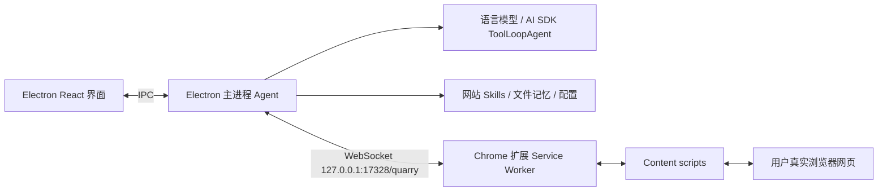
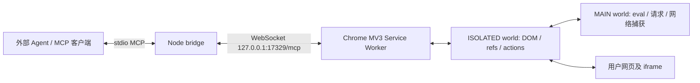
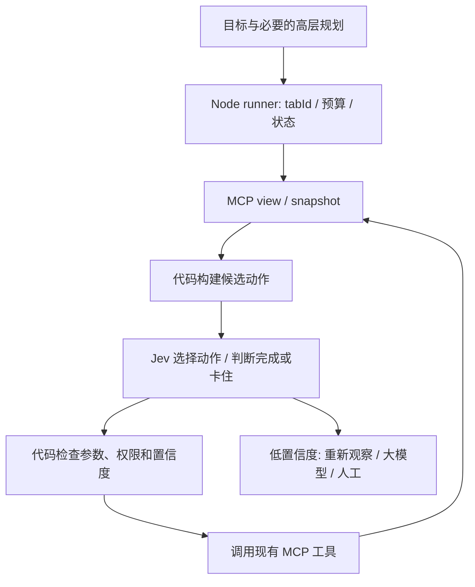

# browser-use 复刻与架构整理

核查日期：2026-09-20。项目范围仅限通用 browser-use：页面读取、导航、交互与 MCP 接入。本文保留旧仓库的来源和拆分记录，不引入任何垂直业务。

## 来源与复刻边界

| 项目 | 核查提交 | 时间 | 作用 |
| --- | --- | --- | --- |
| [browser-use](https://github.com/ShunL12324/browser-use/tree/5a16c5dca40b457f6232cdbbba404783957eba20) | `5a16c5dca40b457f6232cdbbba404783957eba20` | 2026-06-09 | 本地复刻基线，原仓库只有 Initial commit |
| [jobshark](https://github.com/ShunL12324/jobshark/tree/1ee2122fd35d02f0385498f22b7bf8a017f5d4ab) | `1ee2122fd35d02f0385498f22b7bf8a017f5d4ab` | 2026-05-31 | 对照来源，版本 0.0.3，产品内部名 Quarry |

本地目录为 `/home/shun/projects/jev-browser-use`。保留 browser-use 的 Git 历史，`upstream` 指向原仓库；未配置发布用的 `origin`。JobShark 仅在 `/tmp/jev-source-review/jobshark` 临时检出以便比对，不是本项目的运行依赖。

拆分关系由 browser-use README 明确说明，且源码比对支持：DOM、refs、跨 frame 路由、绝大多数工具实现直接复用；独立版替换了宿主、扩展连接配置及界面。两个仓库没有在此通过 Git 共同祖先来证明完整迁移历史，不能从现有快照还原未提交的设计过程。

本次新增架构文档、验证脚本和环境无关的启动说明，并修正 MCP 标签页目标参数丢失、输入工具 schema 与实际执行要求不一致的问题。后续已新增独立 Jev runner 实验，见 [运行说明与验证](jev-runner.zh-CN.md)。

## 原来的 JobShark / Quarry



- `src/main/agent/agent.ts`：模型循环、对话历史、流式事件、取消控制、任务生命周期。
- `src/main/agent/tools.ts`：AI SDK 工具封装、当前 tab 上下文、结果格式化、文件上传的磁盘读取、技能和记忆工具。
- `src/main/bridge/server.ts`：Electron 内的 WebSocket 服务端；扩展主动连接它。
- `extension/src/`：实际网页执行层。旧版包含 React popup、侧栏、会话／tab 分组状态、任务标题和停止按钮配套。
- `src/main/agent/primer.ts`：根据当前域名提供技能名称和描述，再由 `skill_read` 按需读取正文。旧 CLAUDE.md 中“直接注入正文”的说明已落后于代码。
- `src/main/skills/`、`src/main/memory/`：持久化技能与记忆，位于宿主侧。旧产品技能包未进入独立 browser-use。

这里的“插件”是 Chrome MV3 扩展。两个仓库中的浏览器接入设计并不是 Codex/Claude 的插件市场包；独立项目对外提供的是 MCP server。

## 拆出来的 browser-use



| 层 | 本地入口 | 责任 |
| --- | --- | --- |
| 启动 | `packages/bridge/src/index.ts` | 读取端口，启动 WS 和 stdio MCP |
| MCP | `packages/bridge/src/mcp-server.ts` | 注册 18 个 browser_* 工具，返回 JSON 文本或 MCP isError |
| 参数适配 | `packages/bridge/src/schemas.ts` | Zod schema、工具描述、扁平参数转扩展协议 |
| WS 宿主 | `packages/bridge/src/ws-host.ts` | 按请求 id 关联结果、等待扩展、超时和断线处理 |
| 扩展连接 | `packages/extension/src/service-worker/bridge.ts` | 主动连接、重连、心跳、执行命令并记录活动 |
| 工具调度 | `packages/extension/src/lib/tools/index.ts` | 将工具名分发到具体实现，统一包装错误 |
| DOM 执行 | `packages/extension/src/content-scripts/` | 页面遍历、元素引用、输入／点击、主世界通信 |
| 扩展界面 | `packages/extension/src/popup/popup.ts` | 连接状态、地址、最近五条工具调用 |

外部 Agent 决定做什么；Node 只桥接；扩展执行动作。独立版没有内置模型、API key、任务规划器或自主循环。普通浏览器工具调用不需要模型 key。

### 一次调用怎么走

1. MCP 客户端调用 `browser_click({tabId: 42, ref: "f2:e3"})`。
2. `reshapeParams` 转成路由 `tabId:42` 与参数 `target:{ref:"f2:e3"}`。
3. WS 发出 `{v:1, kind:"command", id, tool:"click", tabId, params}`。
4. 扩展解析 frame/ref，将操作发给 tab 42 的 frame 2。
5. 页面执行，扩展以相同 id 回复 `result`；bridge 再回复 MCP。
6. 失败携带 `code`、`short_term`、`message`，交给调用方决定如何恢复。

协议类型目前在 bridge `types.ts` 与 extension `shared/bridge.ts` 两边手动维护；DOM 工具参数另见 extension `shared/protocol.ts`。它们并非自动生成的单一共享包。

### 18 个工具

| 用途 | 工具（均加 browser_ 前缀） |
| --- | --- |
| 观察 | view、snapshot、inspect、network_log |
| 网页交互 | navigate、click、type、press_key、select、hover、scroll、wait_for、upload_file |
| 标签页 | tabs |
| 页面上下文访问 | eval_js、get_cookie、request |
| 顺序执行 | batch |

`view` 返回阅读顺序 Markdown 与元素 refs；目前没有截图。`snapshot` 返回结构化 interactables，适合构建 Jev 候选动作。ref 在同一 DOM 元素仍存活时稳定；跨 frame 的 ref 加 `fN:` 前缀。导航或元素重建后应重新观察。

工具通过 content scripts 和 Chrome 扩展 API 工作，manifest 没有 debugger 权限；不是 Playwright/CDP 驱动。合成 DOM 事件并不保证所有网站都接受，也不代表自动化不可检测。

`batch` 顺序执行，最多 50 项，不允许嵌套；默认遇错停止，navigate 或 tab switch/new 后停止。注意 batch 内部 `input` 使用扩展的原生参数形状，例如 click 需要 `{target:{ref:"e1"}}`；不会对每一项再次执行 MCP 的扁平参数转换。

### 拆分保留与移除

| 能力 | 独立版情况 |
| --- | --- |
| DOM walker、refs、iframe、shadow DOM、网络捕获、18 个工具 | 保留 |
| Electron Agent 循环与模型设置 | 移除，由 MCP 客户端承担 |
| Chat / History / Skills / Memory 产品界面 | 移除 |
| 旧产品技能、记忆与业务模块 | 未迁移 |
| 侧栏、会话状态、tab 分组／状态管理 | 移除，popup 简化 |
| 宿主入口 | Electron WS 改为独立 Node stdio MCP + WS |
| 默认端口／路径 | 17328/quarry 改为 17329/mcp |
| 文件上传 | 独立 MCP 接收 base64 文件内容，不接收本地文件路径 |
| 页面 Stop 事件 | 扩展仍发 agent.stop，Node 仅记录；未实现 Agent 取消闭环 |

对比也发现独立版有 `roleMatches` 导出等小差异，因此不是 JobShark extension 目录的完全镜像。应以独立仓库为基线，按需求选择性移植旧产品能力。

## 已知限制及本次修正

- 单个 bridge 占用一个端口；同端口第二个进程报 EADDRINUSE。每个 bridge 只保留最新扩展连接，没有多会话隔离或任务队列。
- 缺省工具作用于当前活动 tab。未来自动循环应固定 tabId，避免用户切换标签后误操作别的页面。
- WS 默认等待扩展 15 秒，命令超时 120 秒；扩展每 20 秒发心跳，45 秒未收到 pong 则重连。
- 仅绑定 loopback；当前未做连接认证或 Origin 校验。若未来改为跨机器部署，需要明确认证与连接边界。
- 后续 Jev 实验修复 bridge 退出：主动关闭已连接扩展并拒绝等待调用，释放端口；新增连接保持期间退出的回归测试。
- 本次修正：tabs 的路由 tabId 原先被剥离，导致 switch/close 收不到 params.tabId；现两处均保留。
- 本次修正：type 原 schema 允许不传 ref，但执行层明确要求 ref；现 schema 要求非空 ref，text 只表示输入内容。
- 本次修正：snapshot 描述原称默认 50，执行代码实际默认不截断；已校正描述。
- 保留来源锁文件。首次 npm ci 报告 12 个依赖漏洞（1 low、3 moderate、8 high），本次未做依赖升级，也未完成逐项影响分析。

## 本地运行与验证

在仓库根目录：

```sh
npm ci
npm run build
npm test
```

Chrome 开发者模式加载 `packages/extension/dist/`。用支持 stdio MCP 的客户端启动 `node /home/shun/projects/jev-browser-use/packages/bridge/dist/index.js`。MCP JSON 配置示例见 README。这两个进程必须能通过相同机器的 127.0.0.1 互通；远程 Linux bridge 不能直接连接另一台 Mac 的 localhost 扩展。

默认端口 17329。bridge 可通过 `BROWSER_USE_PORT` 改端口，但扩展也需对应修改连接配置；当前 popup 没有配置编辑表单。

验证记录：Node v24.13.0、npm 11.6.2；完整构建通过。自动测试启动真实 stdio MCP 进程，使用模拟 WebSocket 扩展检查工具枚举、标签页目标参数、错误透传、心跳；另验证输入 ref schema。它不模拟 DOM、不代表真实 Chrome 页面交互已验收。

真实 Chrome 验收步骤：加载扩展 → 连接 MCP → browser_tabs list 获取 tabId → 在专用测试标签页 navigate → view/snapshot → 按 ref 点击／填写 → tabs new/switch/close → 重载扩展检查重连。本次没有安装或操作用户日常浏览器扩展，也没有写入全局 MCP 配置。

## Jev 接在哪里（初步设计与已实现实验）

以下是初步实验方向，尚未定为完整重构方案。当前已有最小 runner，实际范围与验证结果见 [Jev 实验](jev-runner.zh-CN.md)。完整阅读官方 109 页后，补充了 [接口语义、Function Calling、并行参数选择与限制](typesafe/reading.zh-CN.md)。候选不必枚举完整动作组合，独立参数问题可以预问后按分支消费；state 也不要求统一的庞大页面 schema。

依据 [TypeSafe 官方文档](https://docs.typesafe.ai/introduction)，Jev 根据 state 回答预先定义的 Choice / Score / Noul 问题，返回结构化决策；自由文本生成需要另一个来源。

已按独立 Node runner 作为现有 MCP 客户端的方式完成第一轮实验：



先把 Jev 当决策层使用，复用扩展执行层和协议。API key 放 Node 环境中。候选项由代码绑定具体工具和 ref，Jev 返回选择，代码再映射成合法调用。填写内容由用户输入、已知数据或文本模型产生；不要期待 Jev 生成任意搜索词、URL 或 JavaScript。

MVP 建议仅允许 view/snapshot、navigate、click、type、scroll、wait_for，并要求固定 tabId、每步观察、最大步数／耗时／费用、重复动作检测。先在本地测试页做“搜索 → 打开结果 → 判断找到目标”或“填写但不提交”任务；记录成功率、动作次数、延迟、费用、大模型回退次数。完成判断需要页面证据，不能只依据 Jev 的置信度。

复刻的 browser-use 是“执行层”；Jev runner 才是新增的“自主决策层”。当前范围仅包含通用浏览器能力；后续 Jev 实验使用通用测试页面，不引入原产品业务。
